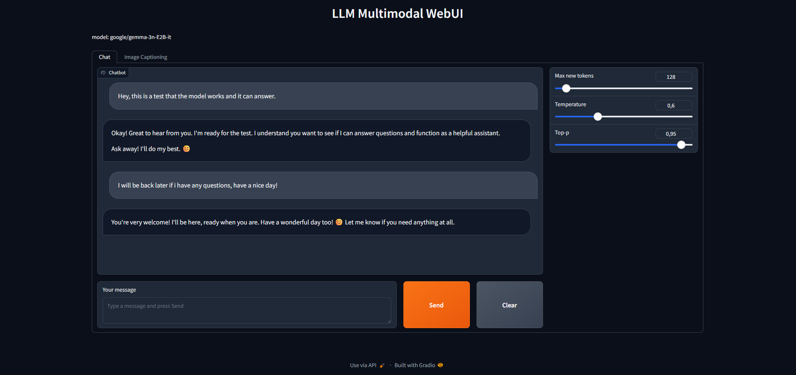
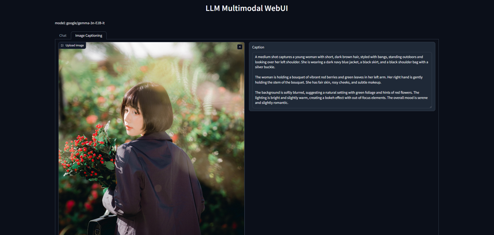

# LLM Multimodal WebUI

A Gradio-based web interface for multimodal generation (Gemma3n 5B as a default model).

## Screenshots




## Requirements

- NVIDIA GPU (8GB+ VRAM)
- Python 3.11+
- CUDA 12.1+

## Installation

1. Clone the repository:
```
git clone https://github.com/vpakarinen2/llm-multi-gradio-webui.git
cd llm-multi-gradio-webui
```

2. Create/activate virtual environment:
```
python -m venv .venv

# Windows
.venv\Scripts\activate

# Linux/Mac
source .venv/bin/activate
```

3. Install PyTorch with CUDA:
```
pip install torch --index-url https://download.pytorch.org/whl/cu121
```

4. Install dependencies:
```
pip install -r requirements.txt
```

## Hugging Face Token

1. Log in to Hugging Face
2. Create an access token (Settings → Access Tokens).
3. Log in:
```
huggingface-cli login
```

## Usage
```
python -m app.server
```

## Author

Ville Pakarinen (@vpakarinen2)
