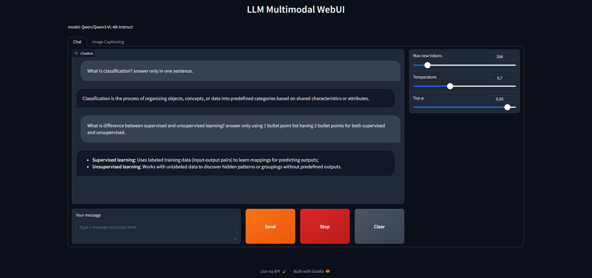
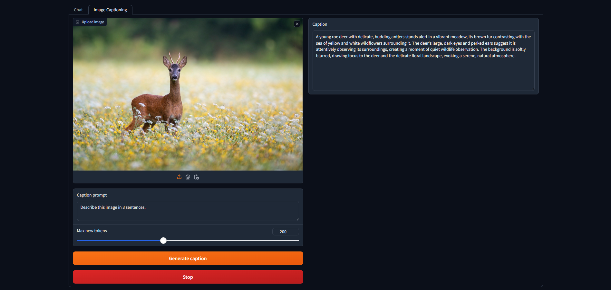

# LLM Gradio WebUI (text + image captioning).

A Gradio web interface for multimodal generation (Qwen3-VL default model).

## Screenshots




## Requirements

- NVIDIA GPU (8GB+ VRAM)
- Python 3.11+
- CUDA 12.1+

## Installation

1. Clone the repository:
```
git clone https://github.com/vpakarinen2/llm-multi-gradio-webui.git
cd llm-multi-gradio-webui
```

2. Create/activate virtual environment:
```
python -m venv .venv

# Windows
.venv\Scripts\activate

# Linux/Mac
source .venv/bin/activate
```

3. Install PyTorch with CUDA:
```
pip install --index-url https://download.pytorch.org/whl/cu121 torch torchvision torchaudio
```

4. Install dependencies:
```
pip install -r requirements.txt
```

5. Create `.env` file:
```
GRADIO_SERVER_NAME=127.0.0.1
GRADIO_SERVER_PORT=7860

APP_MODEL_ID=google/gemma-3n-E2B-it
APP_MODEL_MAX_NEW_TOKENS=256
APP_MODEL_TEMPERATURE=0.7
APP_MODEL_DTYPE=bfloat16
APP_MODEL_DEVICE=cuda
APP_MODEL_TOP_P=0.95
```

## Hugging Face Token

1. Log in to Hugging Face
2. Create an access token (Settings → Access Tokens).
3. Log in:
```
huggingface-cli login
```

## Usage
```
python -m app.main
```

## Logging

```
[2026-01-06 17:16:08,683] [INFO] app.ui.callbacks: chat_pipeline: start (len_history=1, max_new_tokens=256, temp=0.700, top_p=0.950)
[2026-01-06 17:16:25,862] [INFO] app.ui.callbacks: chat_pipeline: done (len_history=2)
[2026-01-06 17:17:21,690] [INFO] app.ui.callbacks: chat_pipeline: start (len_history=2, max_new_tokens=256, temp=0.700, top_p=0.950)
[2026-01-06 17:18:31,468] [INFO] app.ui.callbacks: chat_pipeline: done (len_history=3)
```

## Author

Ville Pakarinen (@vpakarinen2)
